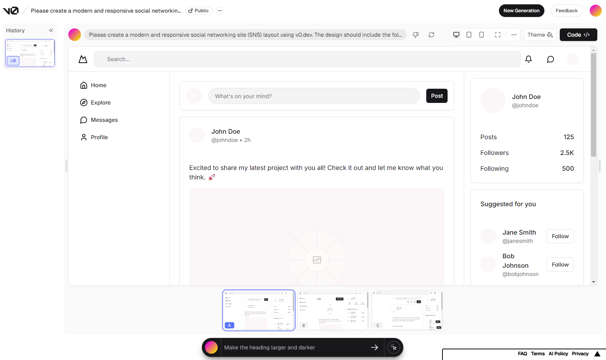

## AIにSNSアプリのひな型を作ってもらう方法

1. ChatGPT等に「v0.devで、SNSライクなレイアウトを作ろうと思っています。丁寧な英語のプロンプトを考えてください。4 00文字以内でお願いします。」みたいな感じで、プロンプトを作ってもらう。  

2. [v0.dev](https://v0.dev/)にアクセスして、さっきのプロンプトを打ち込むと下のようなサイトを生成してくれる。（vercelアカウントが必要。）  
   

3.  右側のCodeボタンをおすと、jsx, css等が確認できるので、それをそのままプロジェクトに張り付ける。（ ChatGPTにコンポーネントとして分割してもらうほうがいいと思う。）  