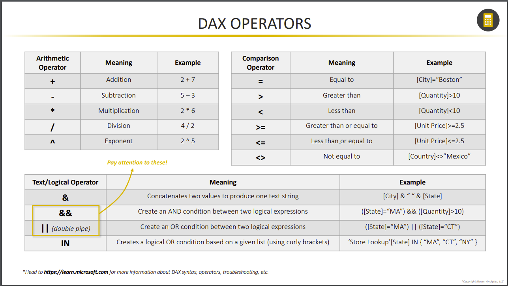

# ABOUT POWER BI

## EXCEL VS. POWER BI

Power Query
Data Model
DAX

The above three use the same function.

## STORAGE & CONNECTION MODES

Connection modes reference.

# POWER QUERY

## ROLLING CALENDARS

If we wanna data from a certain date to today, we should use List.Dates function like images.

## CALCURATED COLUMN BEST PRACTICES

I think this is a best practice.

## APPENDING FILES FROM A FOLDER

When we use fact data like sales data, we should store these datas in folder, then transform these datas.
Because fact data can grow yearly, monthly and dayly, and read eaach time is very very tedius.

## DATA SOURCE PARAMETERS

Use parameters, we can manage database connection easily.

## POWER QUERY BEST PRACTICES

# DATA MODEL

## HIDING FIELDS

⚠️ **WARNING**  
Hide the foreign keys in fact tables to force users to filter using primary keys in dimension tables.

## MODEL LAYOUTS

As much as possible, make views in data model.

## DATA FORMATS $ CATEGORIES

When we use location-based fields, we should change data categories to appropriate one, not text.

## HIERARCHIES

When we use drill up and drill down, we should make hierarchies.

## DATA MODEL BEST PRACTICES

# DAX

## IMPLICIT VS EXPLICIT MEASURES

We should make implicit measure, not explicit.

## MEASURE TABLES

We should create a dedicated table to store our measures.

## DAX OPERATORS

## COMMON FUNCTION CATEGORIES

## SWITCH TRUE

When we use multiple nested IF statements, we can use switch(true)!

