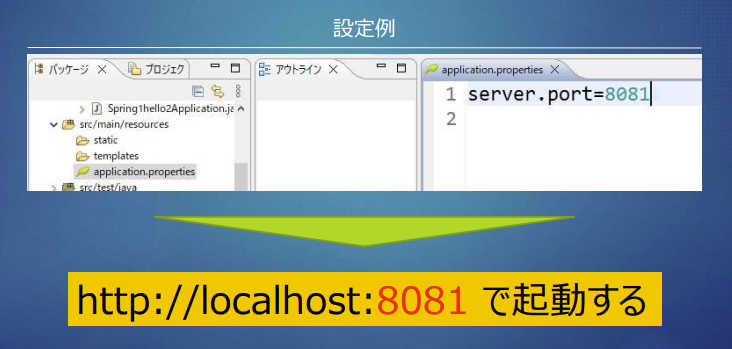

## Pleiades All in One / STS について

- Spring Boot を利用した開発を行う場合、「Pleiades All in One」もしくは、「Spring Tool Suite (STS)」を利用します
- 統合開発環境であるEclipseに対して、日本語化やよく使用するプラグインを予め内包しており、国内では非常によく利用されています
- Pleiades All in Oneをダウンロード解凍する時に、圧縮解凍ソフトによっては、解凍しきれない事象があります。（エラーも表示されず、解凍できていない事が気づかないケースもある）→そのため7zipを用いて解凍する。

## Eclipseの動作を軽くする設定

- eclipse.ini の編集 Javaヒープサイズをはじめから多めに。

- Eclipseのテーマをクラシックに変更する (効果:小)
  - ウィンドウ > 設定 > 一般 > 外観
- ウィルスソフトの検知対象から作業フォルダをはずす (効果:小) 

## spring initializr について

- Spring Initializrは条件を選択・入力し、Spring Bootプロジェクトの雛形を生成するWebサービスです。ブラウザ上もしくはSpring Tool Suite (Pleiades (Eclipse))上で、ビルドツールやバージョン、成果物の情報を入力・選択して、アプリケーションのひな形を簡単に生成することが出来るサービスです。
- eclipse上で、ファイル→新規→Springスタータープロジェクト　で作成してもOK


## @SpringBootApplication

```java
package com.udemy.spring1hello1;

import org.springframework.boot.SpringApplication;
import org.springframework.boot.autoconfigure.SpringBootApplication;

@SpringBootApplication
public class Spring1hello1Application {

	public static void main(String[] args) {
		SpringApplication.run(Spring1hello1Application.class, args);
	}

}
```

- 最上位クラスに`@SpringBootApplication`を記述することで、Spring Bootを使うことができる。

- 各プロジェクトの`実行→SpringBootアプリケーション`はこれが記述されたファイルを見つけて、起動している。
- 下記のように起動時に、`PORT:8080`を使用していることが確認できる
  


## Controllerクラスについて

### @RestController

- 本アノテーションでSpring BootはControllerクラスとして認識
- メソッドの戻り値が、レスポンスの戻り値となる。
- Web API用のControllerで利用する

### @GetMapping

- HTTP Getリクエスト用のアノテーション
- value 属性にURLのパスを指定する
- 紐づいているメソッドが実行される


## PORT変更について

Spring Boot はデフォルトで8080ポートで起動しますが、application.propertiesに設定する事で任意のポートに変更することができます。



## 初期表示のpathについて


プロパティーをひらいて、pathをしていすることで、初期の繊維画面を変更することができる。上記例だと、`http://localhost:8081/welcome`に初期アクセス
