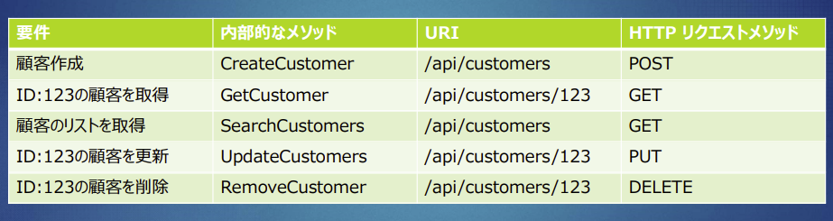

## マイクロサービスとは

- マイクロサービスとは、マイクロ(Micro) 極めて小さい（実際にはほどよい大きさの）サービスで、１つの役割を実装するサービスの事を呼びます。
- 基本的にRestを用いて実装する。

## Restとは

- クライアントから、サーバに実施してほしいことをHTTPプロトコルを用いて依頼する
  - HTTPリクエストにはいくつかのメソッドが存在し、以下4種類のメソッドを利用して、APIの処理を区別するように利用します。
    - GET ID等によって、対象のデータもしくはリストを取得する
    - PUT ID等によって対象のデータを置き換える、データを更新する
    - POST 対象のデータをサーバ上に送信するときに使用し、データを登録する
    - DELETE ID等によって、対象のデータを削除する

- 標準的なHTTPリクエストメソッド (GET/POST/PUT/DELETE) を使用して、APIを実装する
- JSONを使用してやり取り

## Mavenとは

- Javaプログラムをコンパイル・テスト・パッケージング・デプロイを行うツール (類似ツール、Ant / Gradle)
- 使用するJarライブラリ群の依存性を管理
- __pom.xml__ という設定ファイルに、プロジェクトの情報、ライブラリ、プラグイン等を記述する

## Java アノテーション 「@」とは

- JDK1.5から追加された機能、「注釈」の意、アノテーション型
- 補足として機能したり、フレームワークに意図を伝える(処理を指示)できる
- フレームワークで用意されたアノテーションを使えるようになる事が重要
- クラスやメソッド、フィールド名の上に、@アノテーション名 で記述
- アノテーションには引数を渡すことができる

## Dependency Injectionとは

- 「依存性の注入」と訳されています。
- 一般的なJavaプログラムでは、あるクラスから他のクラスを呼び出す時にはnew(インスタンス化)する必要があります。これを依存性のある状態と呼びます。
- インスタンスの生成をSpring Boot (DIコンテナ)にまかせ、インスタンス生成、参照の解決を自動でおこなってもらう事を指します。依存性をDIコンテナが管理し、適用してくれる。
- @Autowired というアノテーションを記述するだけで Spring Boot 管理下にある他のクラスを呼び出すことができます.

## Controllerとは

- Controllerとは、リクエストを受付、必要となる業務ロジックを呼び出し連携させる役割を持ちます。つまり、アプリケーション全体の制御処理を受け持つ部分の事を指します。
  - クライアントからのリクエストの受付処理
  - 入力データの受付処理
  - 入力データの検証
  - ビジネスロジックの呼び出し
  - エラー処理